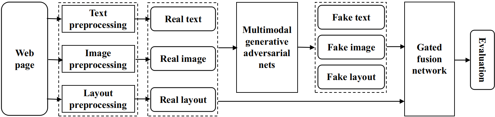

# A Multimodal Generative and Fusion Framework for Recognizing Faculty Homepages

This project is used for identifying faculty homepages in the vertical search engine -- [Professor++](http://www.findingprofessor.com), which is aimed at obtaining the relevant information on researchers and tracing hot research topics in universities all over the world.

Recognizing faculty homepages is essentially a multimodal classification problem in which a target faculty homepage is determined by three different information sources, including text, images, and layout. In addition, recognizing faculty homepages is a class-imbalanced problem in which the total number of samples of a minority class is far smaller than the sample number of other classes. In this study, we propose a multimodal generative and fusion framework for multimodal learning with the problems of imbalanced data and mutually dependent feature modes. In particular, a multimodal generative adversarial network is first introduced to rebalance the dataset by generating pseudo features based on each mode and integrating them to describe a fake sample. Then, a gated fusion network with the gate and fusion mechanisms is presented to capture the links among the different feature modes and reduce the noise for generalization.


## System Architecture



## Main components 
 This framework mainly consists of two components, the **Multimodal Generative Adversarial Nets** and the **Gated Fusion Network**.

1. **Multimodal Generative Adversarial Nets** is used for synthesizing fake features with mutual dependence between them to re-balance webpage dataset.
2. **Gated Fusion Network** is designed for fusing three-modal features from webpages to recognize faculty homepages deployed in a web-crawler. 

## Prerequisites

Our experiment platform was a server with 80 CPU cores (Intel(R) Xeon(R) CPU E5-2698 v4 @ 2.20GHz), 500G RAM, 4 GPUs (NVIDIA Tesla M10). Besides, we utilized python 3.5.5 with sklearn 0.19.1,  keras 2.1.6 and tensorflow-gpu 1.8.0 on  CentOS Linux release 7.4.1708 (Core) as to compare all of the algorithms.

- [NVIDIA GPU (compute capability >= 5.0, memory >= 8G)](https://www.nvidia.com/en-gb/graphics-cards/)
- [NVIDIA driver == 390.46](https://www.nvidia.cn/page/home.html)
- [CUDA == 8.0.61](https://developer.nvidia.com/cuda-toolkit)
- [cuDNN == 7.1.2](https://docs.nvidia.com/deeplearning/sdk/cudnn-install/)
- [Tensorflow == 1.8.0](https://www.tensorflow.org/)
- [Keras == 2.1.6](http://keras.io/)
- [scikit-learn == 0.19.1](https://scikit-learn.org/)

 The following code is utilized to install all needed python packages,

```bash
pip3 install -r requirements.txt
```

## Usage

The following code is utilized to train the **Multimodal Generative Adversarial Nets**.

```python
from DMMFF import train_multi_generators
```

The following code is utilized to train the normal **Generative Adversarial Nets**.

```python
from DMMFF import train_uni_generators
```

Due to the large size of the generated samples in our experiment dataset, which is up to 28 gigabytes, we added two small corpus of fake samples (in '/data_example/generated_data*') generated by GAN and MGAN, respectively, to help users to fast grasp the utilization of generated samples.

The following code is utilized to train **Gated Fusion Network** on the augmented data set by **MGAN**.

```python
from DMMFF import train_gfn_by_multimodal_gan
```

The following code is utilized to train **Gated Fusion Network** on the augmented data set by normal **GAN**.

```python
from DMMFF import train_gfn_by_unimodal_gan
```

The following code is utilized to train **Gated Fusion Network** on the imbalanced data set.

```python
from DMMFF import gfn_on_imbalanced_data
```

The following codes are utilized to train other models (SVM, DT, MLP) on the augmented / imbalanced data set.

```python
from DMMFF import others_on_balanced_data
from DMMFF import others_on_imbalanced_data
```

